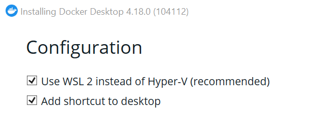

# Установка Docker

----
Перед тем как начать, убедитесь, что:

- Вы используете операционную систему, удобную для разработки (например Ubuntu,
  MacOS). Владельцам Windows мы рекомендуем настроить Windows Subsystem for
  Linux (WSL). О том, как это сделать мы написали
  [гайд](https://guides.hexlet.io/ubuntu-linux-in-windows/).
- Вы знаете, как запустить терминал, и можете выполнить команды в нём

----
Процесс установки Docker отличается в зависимости операционной системы и от типа реализации Docker:
Docker Engine и Docker Desktop.

Docker Engine - это пакет программного обеспечения, который включает в себя все необходимые компоненты
для работы Docker на системе Linux. Docker Engine предоставляет возможность запускать контейнеры,
управлять ими и создавать собственные образы Docker.

Docker Desktop - это приложение для ПК, которое включает в себя стандартный Docker Engine,
графический интерфейс и интеграцию со средой разработки.

## Установка Docker Engine (на примере Linux Ubuntu)
<details><summary style="font-size:140%">Linux</summary>

Будем рассматривать процесс установки на примере дистрибутива Linux Ubuntu
(установка прочих [дистрибутивов Linux](https://docs.docker.com/engine/install/#server)).

Чтобы установить Docker Engine, вам потребуется 64-разрядная версия одной из
[следующих](https://docs.docker.com/engine/install/ubuntu/#os-requirements) версий Ubuntu.
Docker Engine совместим с архитектурами x86_64 (или amd64), armhf, arm64 и s390x.

### Установка Docker Engine
1. Настройте репозиторий:
   1. Обновите apt:
       ```bash
       sudo apt-get update
       ```
   2. Установите пакеты, которые необходимы для работы пакетного менеджера apt по протоколу HTTPS:
       ```bash
       sudo apt-get install \
        ca-certificates \
        curl \
        gnupg
       ```
   3. Добавьте официальный GPG-ключ Docker:
       ```bash
       sudo install -m 0755 -d /etc/apt/keyrings
       curl -fsSL https://download.docker.com/linux/ubuntu/gpg | sudo gpg --dearmor -o /etc/apt/keyrings/docker.gpg
       sudo chmod a+r /etc/apt/keyrings/docker.gpg
       ```    
   4. Добавьте репозиторий:
       ```bash
       echo \
        "deb [arch="$(dpkg --print-architecture)" signed-by=/etc/apt/keyrings/docker.gpg] https://download.docker.com/linux/ubuntu \
        "$(. /etc/os-release && echo "$VERSION_CODENAME")" stable" | \
        sudo tee /etc/apt/sources.list.d/docker.list > /dev/null
       ```
2. Установите Docker Engine следующим образом:
   1. Обновите apt:
      ```bash
      sudo apt-get update
      ```
   2. Установите последнюю версию Docker Engine и Docker-compose:
      ```bash
      sudo apt-get install docker-ce docker-ce-cli containerd.io docker-buildx-plugin docker-compose-plugin
      ```
3. Чтобы использовать утилиту docker, необходимо добавить ваше имя пользователя в группу Docker. Для этого
введите в терминале команду:
    ```bash
    sudo usermod -aG docker ${user}
    ```
    где **user** это имя пользователя.


----
</details>


## Установка Docker Desktop
<details><summary style="font-size:140%">Windows</summary>

Ваш компьютер с Windows должен соответствовать следующим [требованиям](https://docs.docker.com/desktop/install/windows-install/#system-requirements)

### Интерактивная установка Docker Desktop WSL 2 backend (рекомендованный)
1. Скачайте актуальный установщик с официальной страницы [Docker](https://translate.google.com/website?sl=ru&tl=en&hl=ru&client=webapp&u=https://hub.docker.com/editions/community/docker-ce-desktop-windows/)
2. Дважды щелкните по **Docker Desktop Installer.exe**, чтобы запустить программу установки.
3. При установке убедитесь что установлена галочка на **Use WSL 2 instead of Hyper-V (recommended)**



5. Следуйте инструкциям мастера установки.
6. После успешной установки нажмите **Close and restart**, чтобы завершить процесс установки.
7. Если учетная запись администратора отличается от вашей учетной записи пользователя,
необходимо добавить пользователя в группу docker-users. Для этого запустите
***Управление компьютером*** от имени администратора и перейдите в ***Локальные пользователи и группы***
--> ***Группы*** --> ***docker-users***.
Щелкните правой кнопкой мыши, чтобы добавить пользователя в группу.
Выйдите из системы и войдите снова, чтобы изменения применились.

----

### Установка Docker Desktop WSL 2 backend из командной строки
1. Скачайте актуальный установщик с официальной страницы [Docker](https://translate.google.com/website?sl=ru&tl=en&hl=ru&client=webapp&u=https://hub.docker.com/editions/community/docker-ce-desktop-windows/)
2. В терминале перейдите в папку с установщиком и выполняем следующую команду:
    ```bash
    "Docker Desktop Installer.exe" install
    ```
    Если используется PowerShell:
    ```bash
    Start-Process 'Docker Desktop Installer.exe' -Wait install
    ```
    Если используется командная строка Windows:
    ```bash
    start /w "" "Docker Desktop Installer.exe" install
    ```

    <details><summary>Команда install может принимать дополнительные флаги:</summary>

   * ```--quiet```: подавляет вывод информации при запуске установщика
   * ```--accept-license```: принимает соглашение об обслуживании подписки Docker сейчас,
   вместо того, чтобы требовать его принятия при первом запуске приложения.
   * ```--no-windows-containers```: отключает интеграцию контейнеров Windows
   * ```--allowed-org=<org name>```: требует, чтобы пользователь вошел в систему и был частью указанной организации
   Docker Hub при запуске приложения.
   * ```--backend=<backend name>```: выбирает серверную часть по умолчанию для использования в Docker Desktop,
   ```hyper-v``` или ```windows```( ```wsl-2``` по умолчанию)
   * ```--installation-dir=<path>```: изменяет место установки по умолчанию *( C:\Program Files\Docker\Docker)*
   * ```--admin-settings```: автоматически создает ```admin-settings.json``` файл, который администраторы используют
   для управления определенными настройками Docker Desktop на клиентских компьютерах в своей организации.
   Дополнительные сведения см. в разделе [Управление настройками](https://docs.docker.com/desktop/hardened-desktop/settings-management/) .
     * Он должен использоваться вместе с ```--allowed-org=<org name>``` флагом.
     * Например:```--allowed-org=<org name> --admin-settings='{"configurationFileVersion": 2,
     "enhancedContainerIsolation": {"value": true, "locked": false}}'```
       </details>

    
3. Если учетная запись администратора отличается от вашей учетной записи пользователя,
необходимо добавить пользователя в группу docker-users:
    ```bash
    net localgroup docker-users <your username> /add
    ```

----
</details>

<details><summary style="font-size:140%">MacOS</summary>

Ваш Mac должен соответствовать следующим [требованиям](https://docs.docker.com/desktop/install/mac-install/#system-requirements)

### Интерактивная установка Docker Desktop на Mac (рекомендованный)
1. Скачайте актуальный установщик с официальной страницы [Docker](https://docs.docker.com/desktop/install/mac-install/)
2. Дважды щелкните по **Docker.dmg**, чтобы открыть программу установки,
затем перетащите значок Docker в папку **Приложения**.
3. Дважды щелкните **Docker.app** папку **Приложения**, чтобы запустить Docker.
4. Примите условия Соглашения об обслуживании подписки Docker
5. В окне установки выберите:
   * **Используйте рекомендуемые настройки (требуется пароль)**.
   Это позволяет Docker Desktop автоматически устанавливать необходимые параметры конфигурации.
   * **Используйте расширенные [настройки](https://docs.docker.com/desktop/settings/mac/#advanced)**.
6. Выберите **Готово**. Если была применена какая-либо из вышеперечисленных конфигураций, требующих пароля,
будет необходимо ввести пароль для подтверждения.

----

### Установка Docker Desktop из командной строки
1. Скачайте актуальный установщик с официальной страницы [Docker](https://docs.docker.com/desktop/install/mac-install/)
2. В терминале выполните следующие команды, чтобы установить Docker Desktop в папку **Приложения**:
    ```bash
    sudo hdiutil attach Docker.dmg
    sudo /Volumes/Docker/Docker.app/Contents/MacOS/install
    sudo hdiutil detach /Volumes/Docker
    ```

    Поскольку macOS обычно выполняет проверки безопасности при первом использовании приложения,
    **install** выполнение команды может занять несколько минут.

    <details><summary>Команда install может принимать дополнительные флаги:</summary>
    
    * ```--quiet```: подавляет вывод информации при запуске установщика
      * ```--accept-license```: принимает соглашение об обслуживании подписки Docker сейчас,
      вместо того, чтобы требовать его принятия при первом запуске приложения.
      * ```--no-windows-containers```: отключает интеграцию контейнеров Windows
      * ```--allowed-org=<org name>```: требует, чтобы пользователь вошел в систему и был частью указанной организации
      Docker Hub при запуске приложения.
      * ```--backend=<backend name>```: выбирает серверную часть по умолчанию для использования в Docker Desktop,
      ```hyper-v``` или ```windows```( ```wsl-2``` по умолчанию)
      * ```--installation-dir=<path>```: изменяет место установки по умолчанию *( C:\Program Files\Docker\Docker)*
      * ```--admin-settings```: автоматически создает ```admin-settings.json``` файл, который администраторы используют
      для управления определенными настройками Docker Desktop на клиентских компьютерах в своей организации.
      Дополнительные сведения см. в разделе [Управление настройками](https://docs.docker.com/desktop/hardened-desktop/settings-management/) .
        * Он должен использоваться вместе с ```--allowed-org=<org name>``` флагом.
        * Например:```--allowed-org=<org name> --admin-settings='{"configurationFileVersion": 2,
        "enhancedContainerIsolation": {"value": true, "locked": false}}'```
    </details>

----

</details>

По [ссылке](https://docs.docker.com/desktop/troubleshoot/overview/) описываются распространенные проблемы и возможные обходные пути.
