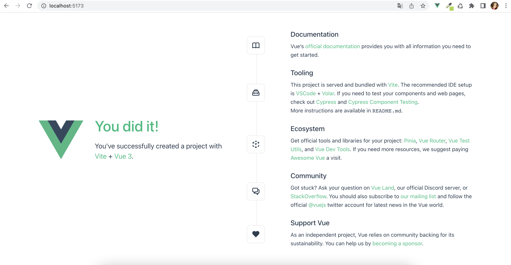

# Создание нового проекта на Vue 3

## Установка Node.js

Сначала необходимо проверить, что на компьютере установлен Node.js. Сделать это можно с помощью команды в терминале:

```bash
node -v
```

Если Node.js установлен, то в терминале будет результат вида "v16.17.1", версия может отличаться. Если же появляется ошибка "command not found", то нужно устновить Node.js — [инструкция по установке](https://github.com/Hexlet/ru-instructions/blob/main/nodejs.md).

## Создание проекта

Создать новый проект можно командой:

```bash
npm init vue@latest
```

Далее появится предложение установить пакет create-vue@latest (этот этап может быть пропущен, если пакет уже установлен), на него необходимо согласиться.

После установки create-vue в терминале будут последовательно появляться вопросы, от ответов на которые зависит итоговая конфигурация нового проекта.

```bash
✔ Project name: … <your-project-name>
✔ Add TypeScript? … No / Yes
✔ Add JSX Support? … No / Yes
✔ Add Vue Router for Single Page Application development? … No / Yes
✔ Add Pinia for state management? … No / Yes
✔ Add Vitest for Unit testing? … No / Yes
✔ Add an End-to-End Testing Solution? … No / Yes
✔ Add ESLint for code quality? … No / Yes

Scaffolding project in ./<your-project-name>...
Done.
```

Первый проект можно сделать максимально простым, отказавшись от всех дополнительных возможностей. После ответов на вопросы появится надпись об успешном создании проекта.

## Сборка и запуск

После создания проекта нужно перейти в папку, где он лежит, далее установить зависимости и запустить проект. Сделать это можно следующими командами:

```bash
cd <your-project-name>
npm install
npm run dev
```

Если все прошло успешно, то в терминале не возникнет ошибок и появится адрес локального хоста. Этот адрес нужно открыть в браузере, появится приветственный экран вида:


```
